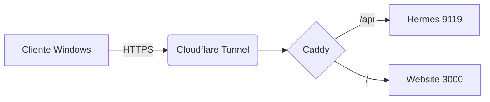

# /imagen-tecnica

## La decisión que importa

**Si el diagrama lleva etiquetas, flechas con significado o estructura exacta, NO lo generes con un modelo de imagen.** Escribirá texto deformado y conexiones inventadas. Un diagrama con una etiqueta mal puesta es peor que no tener diagrama: enseña algo falso.

| Necesidad | Herramienta | Por qué |
|---|---|---|
| Flujo, arquitectura, secuencia, ER | **Mermaid** | Texto exacto, versionable, editable |
| Boceto a mano alzada, pizarra | **`/excalidraw`** | Estilo informal, control total |
| Diagrama de arquitectura software | **`/architecture-diagram`** | Ya instalado |
| Animación matemática, explicación paso a paso | **`/manim-video`** | Ya instalado |
| Infografía con datos | **`/data-charts`** + composición | Cifras exactas |
| Infografía de diseño editorial | `/baoyu-infographic` | Ya instalado |
| Ilustración conceptual **sin texto** | Modelo de imagen | Aquí sí |
| Render de un objeto, corte anatómico | Modelo de imagen | Aquí sí |

## Mermaid — el caballo de batalla

Hermes lo renderiza directamente. Texto exacto, cero alucinación:



Tipos: `flowchart`, `sequenceDiagram`, `classDiagram`, `erDiagram`, `stateDiagram-v2`, `gantt`, `mindmap`.

Alternativa por HTTP para PNG/SVG/PDF (kroki.io), ya usada en este sistema:
```bash
python3 ~/.hermes/scripts/generate_diagram.py --type mermaid --input diagrama.mmd --format png
```

## Cuándo sí usar el modelo de imagen

Para lo **visual sin texto crítico**: ilustraciones conceptuales, renders, cortes, texturas, portadas de tema.

**Corte técnico**
```
Corte transversal de un motor de combustión de cuatro tiempos,
vista lateral, colores planos diferenciando cada pieza,
estilo de ilustración técnica, fondo blanco limpio, sin texto
```
Añade **`sin texto`** siempre: pide las etiquetas fuera y superponlas tú.

**Ilustración educativa**
```
Ilustración del ciclo del agua, estilo libro de texto,
colores planos y claros, contornos definidos, fondo blanco,
composición clara y ordenada, sin texto
```

**Concepto abstracto**
```
Representación visual de una red neuronal como nodos luminosos conectados,
fondo azul oscuro, líneas de conexión brillantes,
estilo tecnológico limpio, sin texto
```

Modelo recomendado: `fal-ai/recraft/v4/pro/text-to-image` (diseño limpio y consistente) o `fal-ai/flux-2-pro`. Si el texto es inevitable dentro de la imagen: `fal-ai/ideogram/v3`.

## Etiquetas: generar sin texto y superponer

Flujo fiable, sin depender de que el modelo escriba bien:

```python
from PIL import Image, ImageDraw, ImageFont
im = Image.open("corte.png").convert("RGB")
d = ImageDraw.Draw(im)
f = ImageFont.truetype("/usr/share/fonts/truetype/dejavu/DejaVuSans-Bold.ttf", 28)

for texto, (x, y), (lx, ly) in [
    ("Pistón", (420, 180), (300, 210)),
    ("Cigüeñal", (420, 460), (320, 470)),
]:
    d.line([(lx, ly), (x - 10, y + 14)], fill="black", width=3)
    d.text((x, y), texto, font=f, fill="black",
           stroke_width=4, stroke_fill="white")     # borde para leerse sobre cualquier fondo

im.save("corte_etiquetado.png")
```
Tipografía exacta, posición exacta, cero letras inventadas.

## Material para clase y presentaciones

- Fondo blanco o muy claro: se imprime y se proyecta bien.
- Contraste alto: un proyector se come los tonos medios.
- Una idea por lámina.
- Proporción 16:9 para diapositiva.
- Texto mínimo 24 pt equivalente; lo que no se lee a 3 metros, sobra.

```bash
imgfx pad lamina.png --ratio 16:9 --color white
imgqc lamina.png --min-mp 2.0
```

## Cierre

Verifica que **lo etiquetado corresponde con lo dibujado**. Un diagrama bonito con la etiqueta cambiada de sitio es un error que se propaga a quien lo estudie. Míralo antes de entregar.
